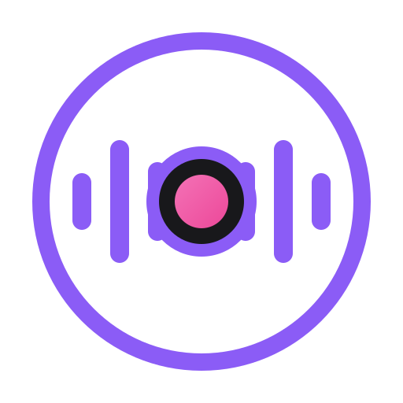

<p align="center">
  
</p>

<h1 align="center">Omarchy Call Recorder</h1>

<p align="center">
  <em>Both sides of the call, safely on disk.</em>
</p>

<p align="center">
  <a href="https://github.com/illegalstudio/omarchy-call-recorder/stargazers"></a>
  <a href="LICENSE"></a>
  <a href="https://omarchy.org"></a>
  <a href="https://x.com/nahime0"></a>
</p>

<p align="center">
  <strong>Microphone + desktop &middot; Live recorded levels &middot; Output-aware capture &middot; Separate lossless tracks</strong>
</p>

<p align="center">
  A native Omarchy Shell widget for recording calls with both sides intact. Capture a selected microphone and the desktop output into a ready-to-share MP3, monitor the levels that actually reach the recording, follow output changes, and keep lossless source tracks plus session metadata for recovery and diagnosis.
</p>

<p align="center">
  <a href="https://opensource.nahi.me"><strong>Official Website</strong></a>
</p>

---

Plugin id: `illegalstudio.omarchy-call-recorder`.

Start it from `Capture > Record call audio`. While recording, the red icon in
the right side of the bar opens controls for recorded audio levels, microphone
and desktop output selection, pause, source muting, and stop.

The desktop capture follows system output changes unless a specific output is
selected. The panel warns when Chrome is playing on a different output.

Each recording creates a mixed MP3, separate lossless FLAC tracks for the
microphone and desktop, and a JSON session report with route and control events.
Files are saved in `~/Music/Recordings/`. The mixed MP3 can be uploaded directly
to Plaud Web.

## Development

Run the complete local validation with:

```bash
make check
```

This validates `manifest.json`, runs `omarchy plugin validate .`, compiles the
Python backend, and checks the release script syntax.
